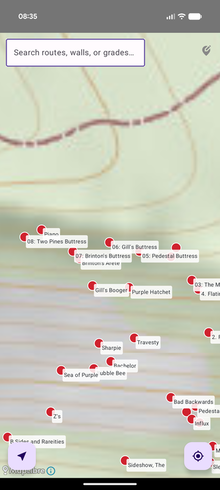
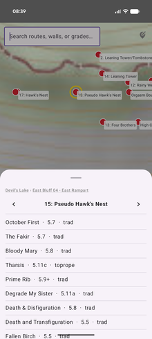

# Crag Atlas

An offline, zoomable climb map for Android, starting with Devils Lake State Park (WI).

 


## Why

Mountain Project chunks a climbing area into disconnected per-wall pages (e.g. "Devils Lake E Bluff - E Rampart") with no way to see how areas relate to each other spatially, and no offline story. Devils Lake's East Bluff has no cell service.

Crag Map instead renders every climb as a pin on a single pannable, zoomable topo map. Zoom out to see the whole park; zoom in and individual formations resolve. Search jumps straight to a route by name or grade. Map tiles and route data are bundled/cached on-device, so it works with zero signal at the crag.

## How it's built

- **Data**: [OpenBeta](https://openbeta.io)'s public GraphQL API — CC0-licensed, community-maintained climbing data. `tools/openbeta_export.py` recursively walks an area's tree (region → bluff → sub-area → formation → route) and writes a SQLite database matching the Android app's Room schema.
- **Basemap**: USGS ImageryTopo raster tiles (public domain aerial + contours). Native tiles through z16; the map may overzoom past that. `tools/build_mbtiles.py` fetches tiles for a bounding box/zoom range into a standard MBTiles package.
- **App**: Kotlin + Jetpack Compose, [MapLibre Native](https://maplibre.org/) for the map, Room for the on-device database (bundled as a prepopulated asset), and a small embedded HTTP server that serves tiles out of the bundled MBTiles file to MapLibre's raster source. Zoom-tiered pin layers are keyed off each area's tree depth, not hardcoded to a specific park's hierarchy shape — a differently-shaped crag needs no schema or code changes, just a re-run of the two export scripts with a different root UUID and bounding box.
- **No INTERNET permission, anywhere.** Everything the app shows — map tiles, climb data, photos — ships bundled or gets merged into a bundle at build time. Nothing is fetched or uploaded live from the phone.

## What we have

Working end-to-end on-device, verified on both a real Pixel phone and an Android emulator (AVD):

**Atlas & search**
- Every area in the tree is tappable at every depth — not just a hardcoded couple of levels — and opens a unified sheet showing its children (in cliff order) or its climbs, with a breadcrumb and prev/next sibling navigation.
- Search matches climb names/grades *and* area/formation names, so "East Rampart" finds the wall directly instead of requiring you to already know a route on it.
- Climb rows show name, grade, type, and — when OpenBeta has one — an X/R/PG/PG13 danger rating as a bold red badge (OpenBeta has no star/quality rating field at all; the safety rating is the closest real signal it does carry).

**Location**
- A GPS "you are here" dot (MapLibre's built-in location engine), a recenter button, and "Near me" — one on-demand GPS fix ranking nearby formations within 150m, never continuous polling (a deliberate battery-life call after an earlier always-on-location approach was closed without merging).

**Field-survey Edit Mode** (a hidden toggle, off by default — a personal on-the-ground tool, not a feature aimed at typical users)
- Captures a real GPS fix — with fix-age and a one-shot compass heading — for an area or an individual climb, to replace OpenBeta's rough centroids with coordinates actually surveyed on the ground. Warns on-device, and again at the desk merge step, if the fix was already stale when captured.
- Captures photos the same way: gated behind Edit Mode, delegating to whatever camera app is already on the phone (no CAMERA permission needed). One photo can be tagged to several climbs at once — the common case for routes a few meters apart on the same wall — via a checklist shown right after the shot.
- A Review sheet lists every captured pin and photo before it ever leaves the phone, with per-item delete — the only way to fix a fat-fingered capture while still in the field.
- "Export" bundles everything captured (pins + photos) into one `field_export.zip` for the share sheet (email/Drive/AirDrop/etc.). See "Desktop tooling" below for how that gets back into the app.
- Portrait-locked, and treats a stale bundled MBTiles/DB as something to warn about rather than silently misbehave on — both hardened specifically ahead of the first real field trip.

**Desktop tooling** (`tools/`)
- `openbeta_export.py` — walks an OpenBeta area tree, writes the bundled Room-schema SQLite DB.
- `build_mbtiles.py` — fetches USGS topo tiles for a bbox/zoom range into an MBTiles package.
- `merge_pin_overrides.py` — applies field-captured GPS pins onto a built `devils_lake.db` (accepts either a raw `pin_overrides.json` or the `field_export.zip` the app's Export action produces).
- `merge_photo_overrides.py` — copies field-captured photos out of that same zip into `assets/photos/<uuid>/`, once per climb/area it's tagged to (a photo covering 3 climbs lands in 3 folders). The app reads these back at runtime with a plain `AssetManager.list()` — no database involved, same read-only-bundled-snapshot shape as `devils_lake.db`.

## Future improvements

- **On-map text labels.** A `SymbolLayer` sharing a `GeoJsonSource` with a `CircleLayer` silently broke rendering for both, on the original test device's GPU (Imagination PowerVR). Labels render as a separate Compose overlay instead for now (see `MapScreen.kt`'s `addAreaLayer`); a real fix — or confirmation this is fine on other GPUs — is still open.
- **Multi-park support.** The data/tile pipeline is already generic (zoom tiers come from each pack's own tree depth, not an assumed park shape), but there's no in-app UI yet for downloading or switching between multiple area packs.
- **Live photo/pin sharing.** Field captures currently only reach other phones via the offline capture → export → desk-merge → next-release pipeline, never a live upload. Real live sync would need a backend, accounts or device identity, and content moderation — a deliberate line not crossed yet, so this stays a conscious trade-off rather than an oversight.
- **Photo annotation.** Overlaying a captured photo with colored route lines and climb names — Mountain-Project-topo style — once a wall has multiple climbs tagged in one photo. Not started; today a photo is just the raw image plus which climbs it's tagged to.
- **Real Room migrations for field-survey data.** Fixed: `PinOverrideDatabase` now ships explicit `MIGRATION_1_2` / `2_3` / `3_4` (no destructive fallback), with schema export under `app/schemas/` and an instrumented `PinOverrideMigrationTest`. `AppDatabase` still uses destructive fallback on purpose — that DB is a disposable bundled snapshot recreated on every data update.
- **Instrumented coverage of the map's own rendering.** Pins/labels/tiles are drawn on a native GL surface with no Compose semantics, so that layer stays a manual on-device check; automated instrumented coverage today reaches the Compose-driven UI on top of it (search, sheets, edit mode, photo capture) but not the map itself.

## Tests

```
python3 tools/test_openbeta_export.py        # walk/depth/is_leaf logic, plagiarism filter, retry-on-timeout, schema
python3 tools/test_build_mbtiles.py          # bbox → tile-index math, MBTiles metadata
python3 tools/test_merge_pin_overrides.py    # pin merge logic, plain-json vs. zip loading, stale-fix detection
python3 tools/test_merge_photo_overrides.py  # photo merge logic, multi-target fan-out, append-across-trips behavior
./gradlew testDebugUnitTest                  # Room/FTS search, via Robolectric — no device/emulator needed
./gradlew connectedDebugAndroidTest          # Compose UI on a real device/emulator — search, sheets, edit mode, photo capture
```

The first four run offline against fixture data — no live network calls, no Android device. `connectedDebugAndroidTest` needs a running device or emulator (`adb devices` must show one) and exercises the real bundled `devils_lake.db` over Room/FTS, the real Compose semantics tree on `MainActivity`, the real runtime location-permission flow, and the photo-capture round trip (camera launch → result → save → tag) with the external camera app stubbed out via Espresso-Intents rather than driven live, since real camera-app UI is too device/vendor-dependent to automate reliably. None of this is covered by Robolectric, and none of it covers the map's own native-GL rendering (pins/labels/tiles), which stays a manual on-device check.

## Building it yourself

```
export JAVA_HOME=/path/to/a/jdk21
./gradlew assembleDebug
```

To regenerate the bundled data/tiles for a different area:

```
python3 tools/openbeta_export.py <openbeta-area-uuid> app/src/main/assets/<pack>.db
python3 tools/build_mbtiles.py <sw-lat> <sw-lng> <ne-lat> <ne-lng> <min-zoom> <max-zoom> app/src/main/assets/<pack>.mbtiles
```

To merge a field trip's `field_export.zip` back into the bundled assets before the next release:

```
python3 tools/merge_pin_overrides.py app/src/main/assets/devils_lake.db field_export.zip
python3 tools/merge_photo_overrides.py app/src/main/assets field_export.zip
```

## Data & basemap credit

Climbing data © [OpenBeta](https://openbeta.io) contributors, CC0. Basemap tiles from the [USGS National Map](https://www.usgs.gov/programs/national-geospatial-program/national-map), public domain.
